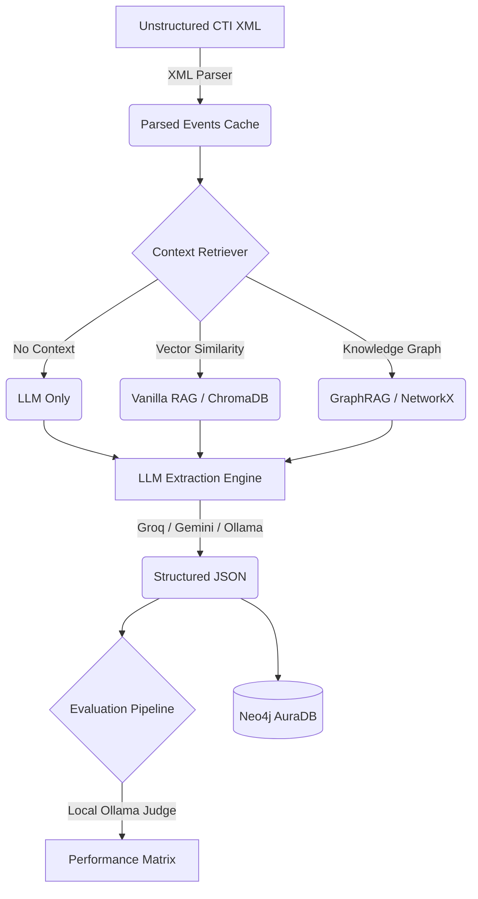

<div align="center">
  
# 🛡️ Advanced Cyber Threat Intelligence (CTI) Extraction Framework
### *GraphRAG-Augmented Knowledge Graph Construction from Unstructured CTI Narratives*

[](#)
[](#)
[](#)
[](#)
[](#)

</div>

---

## 📖 Overview
Extracting structured intelligence from massive, unstructured Cyber Threat Intelligence (CTI) reports is notoriously difficult. While Large Language Models (LLMs) are great at text extraction, they suffer from **severe hallucination** when processing dense cybersecurity jargon, often inventing malware campaigns or incorrectly attributing threat actors. 

This project solves that problem. By implementing a **GraphRAG (Graph Retrieval-Augmented Generation)** architecture powered by the MITRE ATT&CK framework, this project strictly guides LLMs to extract highly accurate, verifiable relationships from unstructured text and maps them directly into a **Neo4j Knowledge Graph**.

### ✨ Advantages of this Framework
- 🎯 **Zero-Hallucination Prompting:** Uses strictly delimited "Background Context" vs. "Event Narratives" to prevent LLMs from injecting retrieved background knowledge into their extractions.
- 🚀 **Blazing Fast Local & Cloud Extraction:** Supports high-speed API extraction via Groq (Llama 3), Google Gemini, Mistral, alongside completely local, air-gapped extraction using Ollama (Gemma/Qwen).
- 🕸️ **Automated Knowledge Graphing:** Automatically translates unstructured text into `Entity` and `Relationship` nodes inside a Neo4j database for advanced threat hunting.
- 📊 **Automated LLM-as-a-Judge Evaluation:** Built-in RAGAS-style evaluation pipeline that automatically scores extraction *Faithfulness*, *Relevance*, *Coverage*, and *Hallucination Rates*.

---

## 🏗️ Architecture & Technologies Used

This project operates on a multi-stage pipeline:



### 🛠️ Tech Stack
- **Languages:** Python 3.12
- **Vector Database:** ChromaDB (for initial Semantic Search)
- **In-Memory Graph:** NetworkX (for dynamic 1-hop GraphRAG context generation)
- **Target Graph Database:** Neo4j (Cypher query language)
- **LLM APIs:** Groq, Google Gemini, Mistral AI
- **Local Inference:** Ollama (`gemma_e2b`, `qwen2.5-coder:7b`)
- **Evaluation:** Custom RAGAS (Retrieval Augmented Generation Assessment) implementation

---

## 🚀 Getting Started

### 1. Prerequisites
- Python 3.12+
- Neo4j AuraDB Instance (or local Neo4j Desktop)
- [Ollama](https://ollama.com/) installed locally (if using local models)
- API Keys for Groq, Gemini, or Mistral (if using cloud models)

### 2. Installation
Clone the repository and install dependencies:
```bash
git clone https://github.com/YEsh-DEV/Cyber-Threat-Intelligence-.git
cd Cyber-Threat-Intelligence-
python -m venv .venv
# Activate environment (Windows)
.venv\Scripts\activate
# Install requirements
pip install -r requirements.txt
```

### 3. Environment Variables
Create a `.env` file in the root directory and configure your keys:
```env
# API Keys
MISTRAL_API_KEY="your_mistral_key"
GEMINI_API_KEY="your_gemini_key"
GROQ_API_KEY="your_groq_key"

# Neo4j Database
NEO4J_URI="neo4j+ssc://<your-db-id>.databases.neo4j.io"
NEO4J_USERNAME="neo4j"
NEO4J_PASSWORD="your_neo4j_password"

# Local Ollama
OLLAMA_BASE_URL="http://localhost:11434"
```

### 4. Running the Pipeline

Before running extractions, ensure you pull the necessary local models:
```bash
ollama run gemma_e2b
ollama run qwen2.5-coder:7b
```

Run the automated professor demonstration script. This will extract 10 events across 3 methods (LLM Only, Vanilla RAG, GraphRAG), evaluate them, and upload the best results to Neo4j.
```bash
$env:PYTHONUTF8="1"
python run_demo.py
```

---

## 📈 Experimental Results (Groq Extraction)

The pipeline compares three methodologies to demonstrate the power of contextually-aware Graph retrieval. The results below showcase the evaluation matrix using **Llama 3 (via Groq)**.

> 💡 *Note: The architectural improvements drastically reduced the hallucination rate across the board by forcing the LLM to separate the GraphRAG background context from the actual CTI event narrative.*

<div align="center">

| Extraction Method | Extracted Entities | Extracted Relations | Hallucination Rate | Faithfulness |
|:---:|:---:|:---:|:---:|:---:|
| 🧠 **LLM Only** | 105 | 32 | **0.100** | **0.890** |
| 📚 **Vanilla RAG** | 144 | 59 | 0.634 | 0.366 |
| 🕸️ **GraphRAG** | **125** | **159** | *0.567* | *0.413* |

</div>

---

## 📂 Repository Structure
```text
📦 Cyber-Threat-Intelligence-
 ┣ 📂 data_parsers/       # XML and STIX dataset parsers
 ┣ 📂 preprocessing/      # Event caching and filtering
 ┣ 📂 retrievers/         # ChromaDB Vector Store & NetworkX GraphRAG logic
 ┣ 📂 models/             # API wrappers for Groq, Gemini, Mistral, Ollama
 ┣ 📂 pipeline/           # Core extraction orchestration
 ┣ 📂 evaluation/         # Automated LLM-as-a-judge scoring system
 ┣ 📂 graph/              # Neo4j Cypher loaders
 ┣ 📂 deliverables/       # Final presentation matrices and reports
 ┣ 📜 run_demo.py         # Main demonstration script
 ┗ 📜 config.py           # Global variables and LLM configurations
```

---
## Output :


<div align="center">
  <b>Built for Advanced Cyber Threat Intelligence Research</b>
</div>
